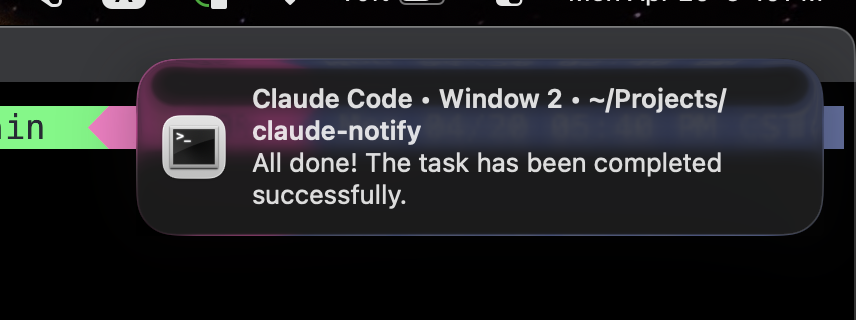

# claude-notify

A Claude Code plugin that sends a macOS notification when Claude finishes a task.



## Features

- Notification title shows the working directory
- Notification body shows the last line of Claude's response
- When inside tmux: title includes the window number, clicking the notification focuses the window

## Requirements

- macOS
- [terminal-notifier](https://github.com/julienXX/terminal-notifier): `brew install terminal-notifier`

## Installation

```
/plugin marketplace add szchenghuang/claude-notify
/plugin install claude-notify@claude-notify
/reload-plugins
```

## Uninstallation

```
/plugin uninstall claude-notify@claude-notify
/plugin marketplace remove claude-notify
```

## Supported terminals

iTerm2, Kitty, Terminal.app, Ghostty, and Warp. Clicking the notification will open the correct terminal app.
